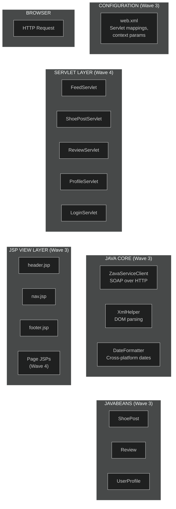
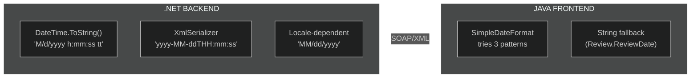
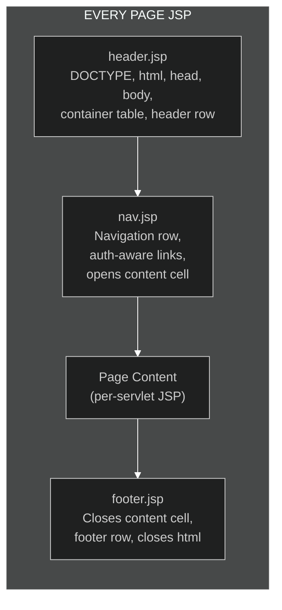

# Wave 3 — Java Frontend Core

> **Phase 3 of 7** · JavaBeans, SOAP client, XML/date utilities, servlet configuration, JSP layout
>
> *The infrastructure the servlets will stand on.*

---

## What We Built

Wave 3 constructs the Java frontend's foundation — everything the feature servlets in Wave 4 will depend on. This is the mirror image of Wave 2: where the .NET side builds models and data access to serve SOAP responses, the Java side builds models and utilities to *consume* them. The patterns are different because the era conventions are different, but the problems are the same.

The Java side has its own flavor of legacy. Where C# 3.0 gave developers auto-properties, Java 1.6 gave them... nothing. Every getter, every setter, every `toString()` — all written by hand. Where .NET has `SqlDataReader`, Java has `org.w3c.dom.Document`. Where `Web.config` is lived-in XML, `web.xml` is *exhaustively* commented XML. These aren't the same legacy patterns wearing different syntax — they're the legacy patterns of a different developer culture, a different toolchain, and a different set of trade-offs.

### Work Items in This Wave

| ID | Title | Owner | What It Delivers |
|----|-------|-------|-----------------|
| WI-11 | Java Model Beans | Shuri | `ShoePost.java`, `Review.java`, `UserProfile.java` |
| WI-12 | SOAP Client | Banner | `ZavaServiceClient.java` — hand-rolled SOAP over HTTP |
| WI-13 | XML/Date Utilities | Shuri | `XmlHelper.java`, `DateFormatter.java` |
| WI-14 | web.xml | Shuri | Servlet mappings, welcome file, session config |
| WI-15 | JSP Includes | Shuri | `header.jsp`, `nav.jsp`, `footer.jsp` layout fragments |

---

## Java Frontend Architecture



The architecture is classic J2EE, stripped to the minimum: no framework, no dependency injection, no annotation scanning. Servlets read configuration from `web.xml`, call the SOAP client, get back JavaBeans, stuff them into request attributes, and forward to JSPs. The JSPs use includes for layout and scriptlets for logic. Simple, explicit, and entirely hand-wired.

---

## WI-11: Java Model Beans

**Owner:** Shuri · **Size:** Medium · **Priority:** P1

### The Boilerplate Is the Point

Three JavaBeans live in `com.zava.beans` — `ShoePost.java` (282 lines), `Review.java` (245 lines), and `UserProfile.java` (335 lines). Together, they're over 860 lines of code that do almost nothing besides hold data. No Lombok. No code generation. Every getter and setter written by hand.

This is what Java 1.6 data classes looked like. The verbosity isn't a failure — it's the language. There was no `record` keyword, no `@Data` annotation, no property shorthand. If you wanted a field, you wrote a field, a getter, a setter, and a Javadoc comment for each. Multiply by nine fields per bean, multiply by three beans, and you get 860 lines.

### ShoePost.java — The Primary Model

`ShoePost.java` mirrors the C# `ShoePost` class from Wave 2, but the Java conventions are visibly different:

```java
/**
 * JavaBean representing a shoe post from the Zava Social community.
 * 
 * Maps to the ShoePost complex type defined in ZavaService.wsdl.
 * Field names match the SOAP response element names from the .NET backend.
 * 
 * NOTE: PostDate is stored as java.util.Date here, but the SOAP service
 * returns xsd:dateTime as a string. Parsing happens in the SOAP client
 * layer -- see SoapDateHelper for the format string. If dates show up
 * wrong, check the format mismatch between .NET and Java first. - JK 2008
 *
 * @author shuri
 * @version 1.0
 * @since 2007-04-15
 */
public class ShoePost implements Serializable {

    private static final long serialVersionUID = 1L;

    private int PostId;
    private String UserName;
    private String Brand;
    private String Model;
    private String Description;
    private String ImageUrl;
    private Date PostDate;
    private int LikeCount;
    private int IsActive;
```

Key differences from the C# version:

| Aspect | C# (`ShoePost.cs`) | Java (`ShoePost.java`) |
|--------|-------------------|----------------------|
| **Size** | 59 lines | 282 lines |
| **Properties** | Mix of auto-properties and backing fields | All hand-written getters/setters |
| **Serialization** | `[Serializable]` attribute | `implements Serializable` + `serialVersionUID` |
| **Date type** | `DateTime` (value type) | `java.util.Date` (reference type) |
| **Boolean type** | `int IsActive` | `int IsActive` (mirroring .NET) |
| **Dead code** | Commented-out `Tags` property | None |
| **Constructors** | None (default only) | Default + full constructor |

The `serialVersionUID` is included on all three beans — a Java serialization requirement that C# handles automatically. Each bean has a different UID:

| Bean | `serialVersionUID` |
|------|-------------------|
| `ShoePost` | `1L` |
| `Review` | `200706221L` |
| `UserProfile` | `2L` |

The `Review` bean's UID is a date-based value (`200706221L` = June 22, 2007), while the others use simple incrementing values. Three beans, three different UID conventions — because different developers wrote them.

### Review.java — The Date Surrender

`Review.java` has the most interesting divergence from its C# counterpart. Where the C# `Review` stores `ReviewDate` as `DateTime`, the Java `Review` stores it as `String`:

```java
/**
 * The date this review was submitted.
 * 
 * Stored as String because of the cross-platform date format
 * mismatch between .NET and Java. See class javadoc for details.
 * 
 * When .NET sends "1/15/2007 3:45:00 PM" and Java expects
 * "2007-01-15T15:45:00", someone has to lose. It's us.
 */
private String ReviewDate;
```

This is the cross-platform date pain point in action. The SOAP service returns dates in at least two different formats depending on which method you call. The `ShoePost` bean fights through this with `java.util.Date` and parsing. The `Review` bean gave up and stores the raw string. The class javadoc explains why:

```java
/**
 * IMPORTANT: ReviewDate is stored as a String here (not java.util.Date),
 * because we got tired of fighting with SimpleDateFormat across the
 * SOAP boundary. The .NET service returns dates in "M/d/yyyy h:mm:ss tt"
 * format sometimes and "yyyy-MM-ddTHH:mm:ss" other times, depending on
 * which method you call. Storing as String and letting the JSP format it
 * was easier than fixing the real problem. TODO: fix the real problem.
 */
```

The `Review` bean also includes a utility method that none of the other beans have:

```java
public String getStarRating() {
    StringBuffer stars = new StringBuffer();
    for (int i = 0; i < 5; i++) {
        if (i < Rating) {
            stars.append("\u2605"); // filled star ★
        } else {
            stars.append("\u2606"); // empty star ☆
        }
    }
    return stars.toString();
}
```

The C# `Utilities.RatingToStars()` uses asterisks "because Unicode stars didn't render in IE6." The Java version uses real Unicode stars — because the JSP renders in the browser on the frontend, not in IE6 on the backend. Same concept, different implementation, different character set.

### UserProfile.java — The Extra Fields

`UserProfile.java` is the most complex bean. It mirrors the C# `UserProfile`, but adds two `transient` fields that aren't part of the WSDL type:

```java
/**
 * The user's shoe posts -- populated by calling GetUserPosts separately.
 * NOT part of the WSDL UserProfile type. This field exists because
 * the profile page needs to show the user's posts, and it was easier
 * to stuff them into the bean than pass them separately through
 * request attributes. Is this good design? No. Does it work? Yes.
 */
private transient List userPosts;

/**
 * The user's reviews -- populated by iterating through shoe posts.
 * Also NOT part of the WSDL type. Added in version 1.1 when
 * the profile page got a "My Reviews" section.
 */
private transient List userReviews;
```

These are raw `List` types — not `List<ShoePost>` or `List<Review>`. Java 5 introduced generics, but these lists predate their adoption in this codebase. The `transient` keyword prevents them from being serialized, which is correct since they're populated by separate SOAP calls.

The `UserProfile` bean also has convenience methods that blur the line between data class and helper:

```java
public int getPostCount() {
    if (userPosts == null) {
        return 0;
    }
    return userPosts.size();
}
```

### The toString() Wars

Each bean has a `toString()` method, and each one uses a different format:

**ShoePost** (by JK):
```java
public String toString() {
    StringBuffer sb = new StringBuffer();
    sb.append("ShoePost{");
    sb.append("PostId=").append(PostId);
    sb.append(", UserName='").append(UserName).append("'");
    // ...
    sb.append("}");
    return sb.toString();
}
```

**Review** (by TM):
```java
public String toString() {
    return "[Review | id=" + ReviewId
        + " | shoePostId=" + ShoePostId
        + " | reviewer=" + ReviewerName
        + " | rating=" + Rating
        + " | date=" + ReviewDate + "]";
}
```

**UserProfile** (by JK, different style than ShoePost):
```java
public String toString() {
    return "UserProfile@" + Integer.toHexString(hashCode())
        + "[UserId=" + UserId
        + ", UserName=" + UserName
        // ...
        + "]";
}
```

Three formats: curly-brace with `StringBuffer`, pipe-separated in square brackets, and `ClassName@hashCode` with square brackets. The comment in `ShoePost.toString()` captures the situation perfectly:

> *NOTE: This format is different from Review.toString() and UserProfile.toString() because different developers wrote them. Don't "fix" this inconsistency -- it's realistic. - JK 2009*

**Why this matters for modernization:** Each bean is a candidate for conversion to a Java `record` (Java 16+), or at minimum a Lombok `@Data` class. The raw `List` types should become parameterized. The `String` date in `Review` should become a proper `java.time` type. The inconsistent `toString()` formats should be standardized. An AI agent should propose all of these changes while preserving the WSDL field name mapping.

---

## WI-13: XML and Date Utilities

**Owner:** Shuri · **Size:** Medium · **Priority:** P1

### XmlHelper.java — The DOM Wrangling

`XmlHelper.java` is the Java analog of `Utilities.cs`, but focused: it exists to parse SOAP XML responses from the .NET backend. Where the C# side uses `XmlSerializer` to automatically deserialize SOAP responses, the Java side parses raw XML by hand using `javax.xml.parsers.DocumentBuilder` and `org.w3c.dom`.

```java
/**
 * DOM parsing utilities for handling SOAP XML responses from the .NET backend.
 * 
 * NOTE: This class does NOT handle namespaces properly. It works because
 * the .NET ASMX service returns elements in the default namespace and we
 * just match on local names. If the service ever changes its namespace
 * handling, this will break silently. - JK 2008
 */
public final class XmlHelper {
```

The class is `final` with a `private` constructor — a proper utility class. It has five methods:

| Method | Purpose |
|--------|---------|
| `getElementText(Element, String)` | Get text content of first child element by tag name |
| `getChildElements(Element, String)` | Get all child elements by tag name (for arrays) |
| `getFirstChildElement(Element, String)` | Get first child element by tag name |
| `getIntValue(Element, String, int)` | Parse child element text as int with default |
| `parseDocument(InputStream)` | Parse an XML document from a stream |

The workhorse is `getElementText` — called for every field on every bean parsed from a SOAP response:

```java
public static String getElementText(Element parent, String tagName) {
    if (parent == null || tagName == null) {
        return "";
    }
    NodeList nodes = parent.getElementsByTagName(tagName);
    if (nodes.getLength() > 0) {
        Node firstNode = nodes.item(0);
        if (firstNode != null && firstNode.getTextContent() != null) {
            return firstNode.getTextContent().trim();
        }
    }
    return "";
}
```

This method is `@deprecated` — but with a characteristically honest reason:

```java
/**
 * @deprecated Use {@link #getFirstChildElement(Element, String)} and read text
 *             directly for better null handling. Nobody has time to refactor
 *             all the call sites though. - TM 2009
 */
```

The `parseDocument` method wraps the `DocumentBuilderFactory` boilerplate with a critical note:

```java
public static Document parseDocument(InputStream input) {
    // NOTE: DocumentBuilderFactory is NOT thread-safe. Create a new one each time.
    try {
        DocumentBuilderFactory factory = DocumentBuilderFactory.newInstance();
        DocumentBuilder builder = factory.newDocumentBuilder();
        return builder.parse(input);
    } catch (Exception e) {
        throw new RuntimeException("Failed to parse XML document: " + e.getMessage(), e);
    }
}
```

The comment about `DocumentBuilderFactory` not being thread-safe is correct — and important. Creating a new factory on every call is the safe pattern. Caching it would introduce intermittent parsing failures under load.

The biggest concern: namespace handling. `getElementsByTagName` matches on local name only and ignores XML namespaces entirely. The ASMX service happens to return elements in the default namespace, so this works — but it's fragile. If the .NET side ever adds explicit namespace prefixes to its SOAP responses, every parsing call in the Java client silently returns empty strings.

### DateFormatter.java — The Cross-Platform Date Problem

`DateFormatter.java` tackles the single hardest problem in the Zava Social stack: parsing dates from a .NET SOAP service in Java.



The class declares four date format patterns:

```java
/** Date format matching what the .NET service returns for most date fields */
private static final String DATE_PATTERN = "MM/dd/yyyy";

/** Full date-time format for display */
private static final String DATETIME_PATTERN = "MM/dd/yyyy HH:mm:ss";

/** XML dateTime format (ISO-8601 without timezone) */
private static final String XML_DATETIME_PATTERN = "yyyy-MM-dd'T'HH:mm:ss";

/** .NET default DateTime.ToString() format -- depends on server locale */
private static final String DOTNET_DATETIME_PATTERN = "M/d/yyyy h:mm:ss a";
```

The `parseServiceDate` method is the most interesting — it tries three formats in priority order:

```java
public Date parseServiceDate(String dateStr) {
    if (dateStr == null || dateStr.trim().length() == 0) {
        return null;
    }

    String trimmed = dateStr.trim();

    // Try XML dateTime first (most common in SOAP responses)
    try {
        SimpleDateFormat sdf = new SimpleDateFormat(XML_DATETIME_PATTERN);
        sdf.setLenient(false);
        return sdf.parse(trimmed);
    } catch (ParseException e) {
        // try next format
    }

    // Try .NET default ToString format
    try {
        SimpleDateFormat sdf = new SimpleDateFormat(DOTNET_DATETIME_PATTERN);
        sdf.setLenient(false);
        return sdf.parse(trimmed);
    } catch (ParseException e) {
        // try next format
    }

    // Fallback to simple date
    try {
        SimpleDateFormat sdf = new SimpleDateFormat(DATE_PATTERN);
        sdf.setLenient(false);
        return sdf.parse(trimmed);
    } catch (ParseException e) {
        System.err.println("WARN: Could not parse date: " + dateStr);
        return null;
    }
}
```

This is brute-force date parsing — try each format until one works, return `null` if none do. It's the practical solution to a problem that shouldn't exist but does: the .NET service returns dates in different formats depending on which method you call and what locale the server is running in.

### The Intentional Thread-Safety Bug

The most important line in `DateFormatter.java` is this static field:

```java
/**
 * Shared date format for display purposes. Used by getRelativeDate().
 * Faster than creating a new one every time.
 */
private static final SimpleDateFormat DISPLAY_FORMAT =
    new SimpleDateFormat("MM/dd/yyyy HH:mm:ss");
```

`SimpleDateFormat` is **not thread-safe** in Java. Sharing an instance across threads causes intermittent, hard-to-reproduce parsing failures — corrupt dates, `NumberFormatException` from the parser, or dates that are off by hours or days. The developer knew this:

```java
// SimpleDateFormat is NOT thread-safe - do NOT make this static
// (see instance methods below for the safe pattern)
```

The comment at the top warns against exactly what the code does. The instance methods (`formatDate`, `formatDateTime`, `parseDate`, `parseServiceDate`) correctly create new `SimpleDateFormat` instances each time. But `getRelativeDate` — a `static` method — uses the shared static instance:

```java
public static String getRelativeDate(Date date) {
    // ...
    // not thread-safe but whatever, it's just for display
    return DISPLAY_FORMAT.format(date);
}
```

The inline comment — *"not thread-safe but whatever, it's just for display"* — is the epitome of legacy thinking. It probably works fine in development with one user. In production with concurrent requests, it will produce wrong dates approximately once every few thousand requests. The kind of bug you can't reproduce on your dev machine.

**Why this matters for modernization:** An AI agent should replace `SimpleDateFormat` with `java.time.format.DateTimeFormatter` (thread-safe), eliminate the multi-format parsing by standardizing on ISO-8601 across the SOAP boundary, and remove the shared static instance.

### Contrast: .NET Utilities vs. Java Utilities

| Concern | .NET (`Utilities.cs`) | Java (`XmlHelper.java` + `DateFormatter.java`) |
|---------|----------------------|------------------------------------------------|
| **Scope** | 40+ methods, 12 regions, zero cohesion | 2 focused classes, single responsibility each |
| **Architecture** | God class | Utility class pattern (final, private constructor) |
| **Date handling** | `DateTime.Parse()` — one format | `SimpleDateFormat` — tries 3 formats, has thread-safety bug |
| **XML handling** | Automatic via `XmlSerializer` | Manual DOM parsing, no namespace support |
| **Dead code** | Extensive (email, image processing, deprecated methods) | Minimal (one `@deprecated` method) |
| **Thread safety** | Not a concern (single-threaded ASMX) | Incorrectly handled (shared `SimpleDateFormat`) |

The Java utilities are better-structured but have a harder problem: they're consuming XML that they don't control, from a service that's inconsistent about date formats. The .NET side generates the XML; the Java side has to survive it.

---

## WI-14: web.xml — The Hand-Wired Configuration

**Owner:** Shuri · **Size:** Small · **Priority:** P1

### 293 Lines of XML Configuration

`web.xml` is the Java servlet deployment descriptor — the equivalent of ASP.NET's `Web.config` for URL routing, session configuration, and application parameters. At 293 lines, it's remarkably large for an application with only five servlets. The size comes from exhaustive comments that read like a developer journal.

The file opens with a comment block that tells the story:

```xml
<!--
  This is the central configuration file for the Zava Social
  web application. ALL servlet mappings are declared here by
  hand -- we are using Servlet 2.4 (pre-annotations era).
  
  Do NOT add @WebServlet annotations to the servlet classes.
  This file IS the configuration. If a servlet isn't mapped
  here, it doesn't exist as far as Tomcat is concerned.
  
  Change log:
    2007-04-15  JK  Initial creation with FeedServlet and LoginServlet
    2007-05-01  TM  Added ShoePostServlet and ReviewServlet
    2007-06-15  JK  Added ProfileServlet, bumped session timeout to 30min
-->
```

### Servlet Declarations and Mappings

Each servlet requires two XML blocks — a `<servlet>` declaration and a `<servlet-mapping>`:

```xml
<servlet>
    <servlet-name>FeedServlet</servlet-name>
    <servlet-class>com.zava.servlets.FeedServlet</servlet-class>
    <load-on-startup>1</load-on-startup>
</servlet>

<servlet-mapping>
    <servlet-name>FeedServlet</servlet-name>
    <url-pattern>/feed</url-pattern>
</servlet-mapping>
```

Five servlets × two blocks each = ten XML blocks, plus comments. In modern Java (Servlet 3.0+), this would be one `@WebServlet("/feed")` annotation on the class. The comments on each declaration read like documentation:

```xml
<!--
  ShoePostServlet - Handles viewing and creating shoe posts.
  GET: displays the shoe post form or a single post detail
  POST: submits a new shoe post to the backend via SOAP
  
  NOTE: This servlet handles both the "new post" form AND the
  "view post detail" page. The URL pattern /post is used for both.
  The postId parameter in the query string determines which mode.
  Yes, this should probably be two separate servlets. No, we're
  not refactoring it now.
-->
```

And the login servlet description captures a classic shortcut:

```xml
<!--
  NOTE: There is no LogoutServlet. Logout is handled by
  LoginServlet with a ?action=logout query parameter.
  This is because TM didn't want to create a whole new
  servlet class just to call session.invalidate().
-->
```

### Context Parameters

Application-wide configuration is stored as `<context-param>` elements — the 2007 Java equivalent of environment variables:

```xml
<!--
  The URL of the backend SOAP service. Change this when deploying
  to different environments. Yes, we know this should probably be
  in a properties file or JNDI. But it works here and nobody
  wants to set up JNDI on every developer's Tomcat instance.
-->
<context-param>
    <param-name>soapServiceUrl</param-name>
    <param-value>http://localhost:8081/ZavaService.asmx</param-value>
</context-param>
```

The comment is self-aware: JNDI would be the "proper" J2EE approach, but configuring JNDI on every developer's local Tomcat instance was too much friction. The hardcoded URL stays.

### Session Configuration

```xml
<!--
  30 minute timeout. Originally was 15 but users complained
  they kept getting logged out while writing long reviews.
  Bumped to 30 in June 2007.
-->
<session-config>
    <session-timeout>30</session-timeout>
</session-config>
```

A small detail with a real story: the timeout was doubled because users were losing their review text when sessions expired mid-write.

### The Missing Error Pages

The most telling section is the one that's entirely commented out:

```xml
<!--
  TODO: Create custom error pages!!
  Right now users see the raw Tomcat error page with stack
  traces. This is a KNOWN ISSUE. TM has a ticket for it.
  Somewhere. Probably.
  
  Uncomment these once the error JSPs are created:
  
  <error-page>
      <error-code>404</error-code>
      <location>/WEB-INF/jsp/error404.jsp</location>
  </error-page>
-->
```

The TODO was added on 2007-08-20. TM was going to do it "next sprint." Five servlets mapped, zero custom error pages created. Users see raw Tomcat stack traces.

### Explicit MIME Mappings

```xml
<!--
  Probably not needed since Tomcat handles most of these, but
  we had issues with CSS not loading on one developer's machine
  so we added these explicitly. Better safe than sorry.
-->
<mime-mapping>
    <extension>css</extension>
    <mime-type>text/css</mime-type>
</mime-mapping>
```

Five MIME mappings that Tomcat already handles by default — added because CSS wasn't loading on one developer's machine. Rather than debug the root cause, the team added explicit mappings. This is the kind of defensive configuration that accumulates in production systems.

### Contrast: web.xml vs. Web.config

| Aspect | `web.xml` (Java) | `Web.config` (.NET) |
|--------|------------------|-------------------|
| **Purpose** | Servlet routing, session, context params | Compilation, security, connection strings, app settings |
| **Size** | 293 lines | 106 lines |
| **Comments** | Exhaustive — reads like a journal | Sparse — mostly inline notes |
| **Dead config** | Commented-out error pages | Commented-out connection strings, 6+ stale feature flags |
| **Self-awareness** | "Yes, this should probably be two separate servlets" | "TODO: turn off before go-live" |
| **Configuration debt** | Unnecessary MIME mappings | Session state connection strings from failed 2008 experiment |

Both files are configuration artifacts of organic growth. The Java side is more verbose but more self-documenting. The .NET side is more compact but has more hidden debt.

**Why this matters for modernization:** `web.xml` should be replaced entirely with `@WebServlet` annotations (or Spring Boot auto-configuration). Context parameters should become externalized configuration. The commented-out error pages should be implemented. An AI agent should handle all of this as part of a framework migration.

---

## WI-15: JSP Includes — The Shared Layout

**Owner:** Shuri · **Size:** Small · **Priority:** P1

### The Table-Based Template System

Three JSP include files in `WEB-INF/jsp/includes/` form the shared layout for every page: `header.jsp`, `nav.jsp`, and `footer.jsp`. Together, they implement a template pattern using `<%@ include %>` directives — the 2007 alternative to template engines like Tiles, SiteMesh, or Thymeleaf.



### header.jsp — Opening the Envelope

`header.jsp` opens *everything*: the DOCTYPE, `<html>`, `<head>`, `<body>`, and the outer layout table. It does not close any of these tags — that's `footer.jsp`'s job.

```html
<!DOCTYPE HTML PUBLIC "-//W3C//DTD HTML 4.01 Transitional//EN"
    "http://www.w3.org/TR/html4/loose.dtd">
<html>
<head>
    <meta http-equiv="Content-Type" content="text/html; charset=iso-8859-1">
    <title>Zava Social - Share Your Kicks</title>
    <link rel="stylesheet" type="text/css" href="/css/zava.css">
</head>
<body>

<table class="container" width="800" cellpadding="0" cellspacing="0"
       border="0" align="center">

    <!-- HEADER -->
    <tr>
        <td class="header">
            <table width="100%" cellpadding="0" cellspacing="0" border="0">
                <tr>
                    <td align="left" valign="middle">
                        <span class="headerTitle">ZAVA SOCIAL</span>
                    </td>
                    <td align="right" valign="bottom">
                        <span class="headerTagline">kicks. culture. community.</span>
                    </td>
                </tr>
            </table>
        </td>
    </tr>
```

This is era-perfect HTML 4.01 Transitional. Table-based layout with `width="800"` (fixed-width for 1024×768 monitors), `align="center"` for horizontal centering, and nested tables for the header row. The CSS classes (`container`, `header`, `headerTitle`, `headerTagline`) come from Parker's `zava.css` — the visual design layer.

The charset is `iso-8859-1`, not UTF-8. This is period-accurate — UTF-8 wasn't the default in the Java/Tomcat world until later.

### nav.jsp — Authentication-Aware Navigation

`nav.jsp` renders the pipe-separated navigation bar and handles the login/logout toggle using JSP scriptlets:

```html
<td align="left">
    <a href="/feed" class="navLink">HOME</a>
    <span class="navSeparator"> | </span>
    <a href="/post" class="navLink">POST A SHOE</a>
    <span class="navSeparator"> | </span>
    <a href="/profile" class="navLink">MY PROFILE</a>
    <span class="navSeparator"> | </span>
<% if (session.getAttribute("isLoggedIn") != null) { %>
    <a href="/login?action=logout" class="navLink">LOGOUT</a>
<% } else { %>
    <a href="/login" class="navLink">LOGIN</a>
<% } %>
</td>
<td align="right">
<% if (session.getAttribute("currentUser") != null) { %>
    <span class="navUser">Welcome back, <%= session.getAttribute("currentUser") %>!</span>
<% } %>
</td>
```

The scriptlet-based auth toggle is the key pattern here. Session attribute `isLoggedIn` controls whether the nav shows LOGIN or LOGOUT. Session attribute `currentUser` controls the welcome message. This is pre-JSTL logic — `<c:if>` would be the "proper" approach, and JSTL is on the classpath, but the include was written before JSTL was adopted.

Note that `nav.jsp` also opens the content table cell (`<td class="content">`) — meaning the page JSP's content goes inside an already-opened table cell.

### footer.jsp — Closing the Envelope

`footer.jsp` closes everything that `header.jsp` and `nav.jsp` opened:

```html
        </td>
    </tr>

    <!-- FOOTER -->
    <tr>
        <td class="footer">
            &copy; 2007 Zava Social. All rights reserved.<br>
            <a href="#" class="footerLink">Contact Us</a>
            <span class="navSeparator"> | </span>
            <a href="#" class="footerLink">Terms of Use</a>
            <span class="navSeparator"> | </span>
            <a href="#" class="footerLink">Privacy Policy</a><br>
            <span class="browserNote">Best viewed in Internet Explorer 6.0 at 1024x768</span>
        </td>
    </tr>

</table>

</body>
</html>
```

The "Best viewed in Internet Explorer 6.0 at 1024x768" is the era's badge of honor. The footer links (`Contact Us`, `Terms of Use`, `Privacy Policy`) all point to `#` — they were never implemented.

### The Include Pattern

Every page JSP follows this structure:

```jsp
<%@ include file="/WEB-INF/jsp/includes/header.jsp" %>
<%@ include file="/WEB-INF/jsp/includes/nav.jsp" %>

<!-- page-specific content here -->

<%@ include file="/WEB-INF/jsp/includes/footer.jsp" %>
```

This is a static include (`<%@ include %>`) — the included file is merged into the page at compile time. It's simpler than `<jsp:include>` (which includes at request time) but has a trade-off: changes to the include files require recompiling every page that uses them.

The `WEB-INF/` location is deliberate — files under `WEB-INF` can't be accessed directly by URL, only via internal forwarding. This prevents someone from hitting `http://localhost:8080/WEB-INF/jsp/includes/header.jsp` directly and getting a broken page fragment.

**Why this matters for modernization:** The include-based layout should be replaced with a proper template engine (Thymeleaf, JSP Tag Files, or Spring MVC's layout dialect). The scriptlet auth logic should move to JSTL/EL expressions. The table-based layout should become semantic HTML with CSS Grid or Flexbox. An AI agent should propose all of these changes as part of a frontend modernization.

---

## Decisions Made in This Wave

### JavaBeans, Not Immutable DTOs

**Decision:** All model classes are mutable JavaBeans with default constructors and setters.

**Why:** The SOAP client populates beans field-by-field after parsing XML elements. Immutable classes would require builder patterns or all-args constructors, which adds complexity with no benefit in a request-scoped lifecycle. The JavaBeans spec (default constructor + getters/setters) is also required for JSP EL expressions like `${shoePost.brand}`.

### No Generated SOAP Stubs

**Decision:** The SOAP client constructs XML by hand and parses responses with DOM.

**Why:** Tools like `wsimport` (JAX-WS) and Apache Axis could generate client stubs from the WSDL. The team chose not to use them because: (1) generated code is hard to debug when something breaks, (2) the WSDL has comments warning against regeneration, and (3) the service has only eight methods — writing the XML by hand was faster than configuring a code generator. This is a pragmatic choice that trades maintainability for control.

### String Dates in Review.java

**Decision:** `Review.ReviewDate` is `String`, not `java.util.Date`.

**Why:** The .NET service returns dates in at least two formats depending on which method returns the data. After fighting with `SimpleDateFormat` parsing failures, the developer gave up and stored the raw string. This is the practical result of a cross-platform date format mismatch — one of the most common pain points in SOAP-based integration.

### Scriptlets in JSP Includes

**Decision:** Authentication logic in `nav.jsp` uses JSP scriptlets (`<% %>`) instead of JSTL (`<c:if>`).

**Why:** The include files were written before JSTL was adopted in the project. By the time JSTL was available, the includes worked and nobody wanted to touch them. This is the "if it ain't broke" principle applied to view templates.

---

## What Comes Next

With the Java core in place, Wave 4 builds the five feature servlets that bring the frontend to life:

- **LoginServlet** — session management, the auth pattern all other servlets depend on
- **FeedServlet** — the landing page, calling `GetTrendingPosts` and `GetRecentPosts`
- **ShoePostServlet** — viewing post details and submitting new shoes
- **ReviewServlet** — reading and writing shoe reviews
- **ProfileServlet** — user profiles with posts and reviews

Each servlet follows the pattern established here: read configuration from `web.xml`, call the SOAP client, parse the response into beans, stuff beans into request attributes, and forward to a JSP that uses the includes for layout.

The two sides of the SOAP boundary are now fully defined. The .NET service exposes eight methods; the Java core has the beans, utilities, and infrastructure to consume them. Wave 4 connects them.

---

*Wave 3 complete. The Java frontend has its bones. Time to hang the meat.* 🏗️
