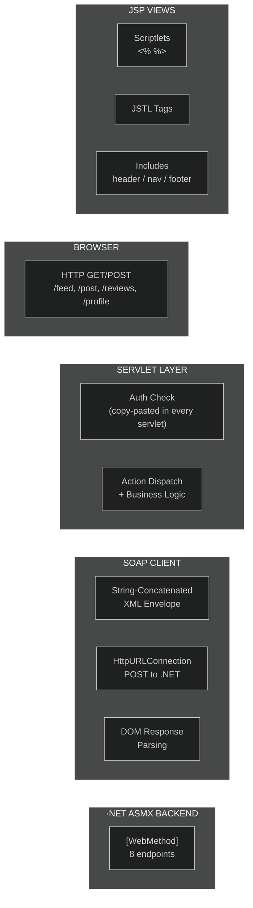
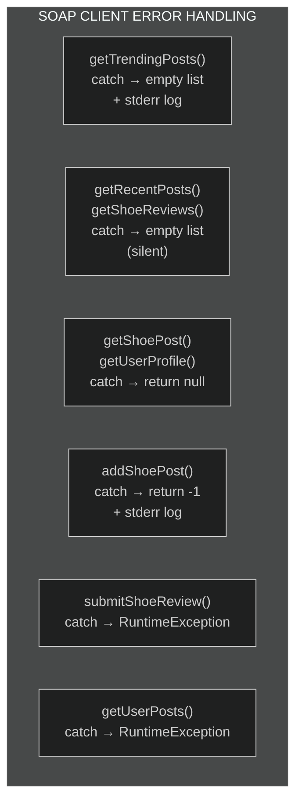
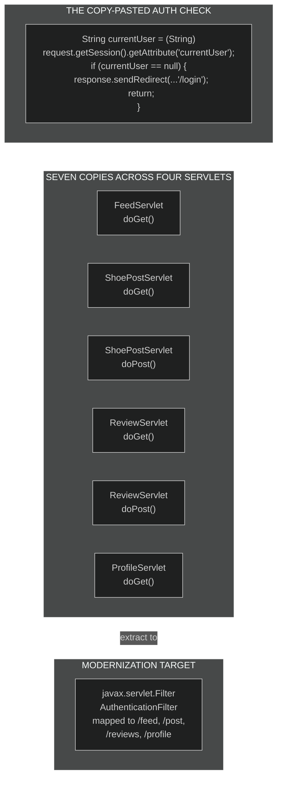
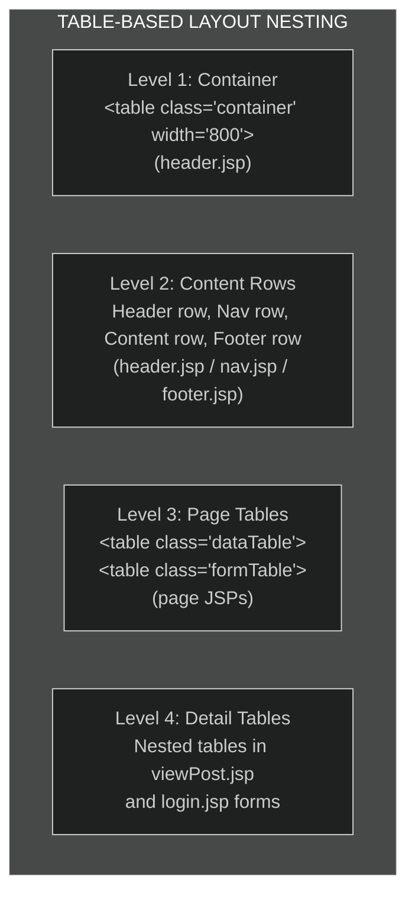
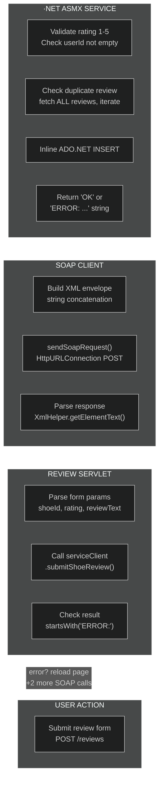

# Wave 4 — Java Frontend Features + SOAP Integration

> **Phase 4 of 7** · Login, Feed, Post, Review, Profile — the servlets and JSPs that make the app usable
>
> *Five servlets, six JSPs, one hand-rolled SOAP client, one copy-pasted auth check.*

---

## What We Built

Wave 4 is where the Java frontend stops being infrastructure and starts being an application. Wave 3 gave us beans, layout, utilities, and a web.xml that maps URLs to servlet classes. This wave fills in every one of those servlet classes — and ties them to the .NET backend through Banner's hand-rolled SOAP client.

The construction story here has two distinct threads. The first is the **SOAP client** (WI-12, technically Phase 3 but documented here because it's the integration backbone): 442 lines of string-concatenated XML envelopes, `HttpURLConnection` calls, and DOM parsing that connect the Java frontend to the .NET ASMX backend. No JAX-WS, no generated stubs — just raw SOAP 1.1 the way it was done in 2007. The second thread is the **five servlets and their JSP views** — each one a self-contained feature that copy-pastes the same auth check, calls the SOAP client, and forwards to a JSP that mixes scriptlets with occasional JSTL.

Every pattern here is a deliberate modernization target. The copy-pasted auth block is a filter extraction. The string-concatenated XML is a REST migration. The scriptlet-heavy JSPs are a template engine upgrade. The two-SOAP-calls-per-page ProfileServlet is a BFF or composite endpoint. An AI modernization agent should identify and propose all of these.

### Work Items in This Wave

| ID | Title | Owner | What It Delivers |
|----|-------|-------|-----------------|
| WI-12 | SOAP Client | Banner | `ZavaServiceClient.java` — hand-rolled SOAP over HTTP |
| WI-16 | LoginServlet | Shuri | Session-based auth flow + `login.jsp` |
| WI-17 | FeedServlet | Shuri | Trending feed + `feed.jsp` + `viewPost.jsp` |
| WI-18 | ShoePostServlet | Shuri | New shoe form + `newPost.jsp` |
| WI-19 | ReviewServlet | Shuri | Reviews display + submit + `reviews.jsp` |
| WI-20 | ProfileServlet | Shuri | User profile page + `profile.jsp` |
| WI-21 | Code Review | Barton | Full Java frontend review |

---

## Request Lifecycle: Servlet to SOAP to Database

Before diving into each piece, here's how a user action flows through the full stack:



The path is: browser → servlet (auth check → action dispatch) → SOAP client (build envelope → HTTP POST → parse response) → set request attributes → forward to JSP (scriptlets + includes) → HTML back to browser. Every request that touches data crosses the SOAP boundary.

---

## WI-12: The Hand-Rolled SOAP Client

**Owner:** Banner · **Size:** Large · **Priority:** P1
**Reviewed by:** Barton (Java) and Hill (.NET contract) — cross-stack integration work

### The Integration Story

`ZavaServiceClient.java` is THE integration layer between the Java frontend and the .NET backend. It's 442 lines of hand-rolled SOAP — no JAX-WS, no wsdl2java, no generated stubs. The class header explains why:

```java
/**
 * Hand-rolled SOAP client for the ZavaService .NET ASMX backend.
 *
 * Calls the backend via string-concatenated XML envelopes over HttpURLConnection.
 * No generated stubs, no JAX-WS -- just raw SOAP 1.1 the way it was done in 2007.
 *
 * NOTE: Do NOT use the WSDL-generated stub. It broke date parsing on the
 * feed page. - JK 2009
 */
```

The comment tells the whole story: someone *did* try generated stubs. They broke. The team fell back to string concatenation and never looked back. This is one of the most common patterns in real-world SOAP integration — generated code works until it doesn't, and then you hand-roll it.

### String-Concatenated XML Envelopes

Every SOAP method in `ZavaServiceClient` builds its envelope the same way — string concatenation:

```java
String soapBody = "<?xml version=\"1.0\" encoding=\"utf-8\"?>"
    + "<soap:Envelope xmlns:soap=\"http://schemas.xmlsoap.org/soap/envelope/\""
    + " xmlns:zava=\"http://zava.example.com/services/2007\">"
    + "<soap:Body>"
    + "<zava:GetTrendingPosts />"
    + "</soap:Body></soap:Envelope>";
```

For methods with parameters, the values are interpolated directly into the XML:

```java
+ "<zava:GetRecentPosts>"
+ "<zava:count>" + count + "</zava:count>"
+ "</zava:GetRecentPosts>"
```

For string parameters, there's at least an `escapeXml()` call — but it was added *after* a production incident:

```java
/**
 * Basic XML escaping for string values going into SOAP envelopes.
 * Only handles the bare minimum -- &, <, >
 * Added after someone posted a shoe with "&" in the name and
 * it broke the entire feed page for 3 hours. - TM 2008
 */
private String escapeXml(String value) {
    if (value == null) {
        return "";
    }
    return value.replace("&", "&amp;").replace("<", "&lt;").replace(">", "&gt;");
}
```

Notice what's *not* escaped: single quotes, double quotes, and any Unicode beyond the ASCII range. The method handles the bare minimum and was added reactively, not proactively.

### HttpURLConnection — The Transport Layer

All SOAP calls go through a single `sendSoapRequest` method:

```java
private InputStream sendSoapRequest(String soapXml, String soapAction) throws Exception {
    URL url = new URL(SERVICE_URL);
    HttpURLConnection conn = (HttpURLConnection) url.openConnection();
    conn.setRequestMethod("POST");
    conn.setRequestProperty("Content-Type", "text/xml; charset=utf-8");
    conn.setRequestProperty("SOAPAction", "\"" + soapAction + "\"");
    conn.setDoOutput(true);

    OutputStream out = conn.getOutputStream();
    out.write(soapXml.getBytes("UTF-8"));
    out.close();

    int responseCode = conn.getResponseCode();
    if (responseCode != 200) {
        throw new RuntimeException("SOAP request failed with HTTP status " + responseCode);
    }

    return conn.getInputStream();
}
```

What's missing:
- **No timeouts** — `connectTimeout` and `readTimeout` are never set. A hung .NET service will block the servlet thread forever.
- **No connection pooling** — every request opens a new TCP connection.
- **No retry logic** — a single failure is final.
- **No SOAP fault parsing** — non-200 responses throw a generic `RuntimeException` without reading the fault detail.
- **Stream not closed** — the `InputStream` is returned to callers, who parse it but never explicitly close it or the underlying connection. This leaks connections under load.

The service URL is hardcoded as a `private static final`:

```java
private static final String SERVICE_URL = "http://localhost:8081/ZavaService.asmx";
```

There's a TODO to move it to `web.xml` as a context-param. It never happened.

### DOM Response Parsing

Responses are parsed using `XmlHelper` — the DOM utility class from Wave 3. The parsing pattern differs across methods, revealing that different developers (or the same developer at different times) implemented them:

**Pattern 1: parseShoePost helper** — Used by `getTrendingPosts()`, `getRecentPosts()`, `getShoePost()`:

```java
private ShoePost parseShoePost(Element el) {
    ShoePost post = new ShoePost();
    post.setPostId(XmlHelper.getIntValue(el, "PostId", 0));
    post.setUserName(XmlHelper.getElementText(el, "UserName"));
    post.setBrand(XmlHelper.getElementText(el, "Brand"));
    // ... more fields ...
    String dateStr = XmlHelper.getElementText(el, "PostDate");
    if (dateStr.length() > 0) {
        Date postDate = dateFormatter.parseServiceDate(dateStr);
        post.setPostDate(postDate);
    }
    post.setLikeCount(XmlHelper.getIntValue(el, "LikeCount", 0));
    post.setIsActive(XmlHelper.getIntValue(el, "IsActive", 1));
    return post;
}
```

**Pattern 2: Inline parsing** — `getUserPosts()` duplicates the exact same logic inline because "different dev wrote this method, didn't know about the parseShoePost helper":

```java
// inline parsing here -- different dev wrote this method, didn't know
// about the parseShoePost helper
List<Element> postElements = XmlHelper.getChildElements(doc.getDocumentElement(), "ShoePost");
for (int i = 0; i < postElements.size(); i++) {
    Element el = (Element) postElements.get(i);
    ShoePost post = new ShoePost();
    post.setPostId(XmlHelper.getIntValue(el, "PostId", 0));
    post.setUserName(XmlHelper.getElementText(el, "UserName"));
    // ... identical field-by-field mapping ...
}
```

**Pattern 3: Inline single-element parsing** — `getUserProfile()` parses inline because "this is the only place we parse user profiles":

```java
// inline parsing for UserProfile -- didn't bother making a helper method
// since this is the only place we parse user profiles
UserProfile profile = new UserProfile();
profile.setUserId(XmlHelper.getIntValue(resultEl, "UserId", 0));
profile.setUserName(XmlHelper.getElementText(resultEl, "UserName"));
// ...
String joinDateStr = XmlHelper.getElementText(resultEl, "JoinDate");
if (joinDateStr.length() > 0) {
    Date joinDate = dateFormatter.parseServiceDate(joinDateStr);
    profile.setJoinDate(joinDate);
}
```

Three different approaches to the same problem — helper method, inline duplicate, and inline one-off. This mirrors the .NET side's `MapShoePost` vs. inline mapping inconsistency (see Wave 2).

### The Cross-Platform Date Challenge

The SOAP client carries the single most important cross-platform pain point in the entire demo:

```java
// The .NET service returns dates in at least 3 different formats. Don't ask.
String dateStr = XmlHelper.getElementText(el, "PostDate");
if (dateStr.length() > 0) {
    Date postDate = dateFormatter.parseServiceDate(dateStr);
    post.setPostDate(postDate);
}
```

The .NET service serializes `DateTime` values through `XmlSerializer`, which can produce different formats depending on whether the value came from `DateTime.Now`, `DateTime.Parse()`, or `Convert.ToDateTime()`. The Java side uses `DateFormatter.parseServiceDate()` — which tries multiple `SimpleDateFormat` patterns — to handle the inconsistency. And `Review.ReviewDate` is stored as a raw `String` on the Java bean because someone gave up trying to parse it reliably (see Wave 3 documentation).

### Error Handling — Five Methods, Four Strategies



| Method | On Error | Logs? | Caller Sees |
|--------|----------|:-----:|-------------|
| `getTrendingPosts()` | Returns empty list | ✅ `System.err` | Empty feed |
| `getRecentPosts()` | Returns empty list | ❌ Silent | Empty feed |
| `getShoeReviews()` | Returns empty list | ❌ Silent | No reviews shown |
| `getShoePost()` | Returns `null` | ❌ Silent | "Post not found" page |
| `getUserProfile()` | Returns `null` | ❌ Silent | "Profile not found" |
| `addShoePost()` | Returns `-1` | ✅ `System.err` | "Failed to create post" |
| `submitShoeReview()` | Throws `RuntimeException` | ❌ | Servlet 500 error |
| `getUserPosts()` | Throws `RuntimeException` | ❌ | Servlet 500 error |

Two methods propagate exceptions as `RuntimeException` (crashing the servlet). Two return sentinel values. Three silently return empty collections. Two log to `System.err`. The inconsistency mirrors the .NET side's four error strategies — but the Java-side strategies don't map cleanly to the .NET-side strategies, creating a double inconsistency across the SOAP boundary.

### The Commented-Out Search Method

```java
// public List<ShoePost> searchPosts(String query) {
//     // Feature was cut in sprint 4 - 2008
//     // Was going to search by brand and model name
//     // String soapBody = "<?xml version=\"1.0\" ...
//     // Never finished implementing this on the .NET side either
//     return new ArrayList<ShoePost>();
// }
```

A feature that was cut from both sides of the stack — the .NET service never got a `SearchPosts` web method, and the Java client never finished the envelope. The code lives on as a commented-out artifact.

**Why this matters for modernization:** The SOAP client is the single highest-value integration modernization target. Replace string-concatenated XML with a REST client (or JAX-WS if staying SOAP). Add timeouts, retries, and circuit breaking. Consolidate parsing patterns. Standardize error handling. Move the service URL to configuration. Close response streams. An AI agent that modernizes this file demonstrates cross-stack understanding.

---

## WI-16: LoginServlet — The Auth Pattern That Gets Copy-Pasted Everywhere

**Owner:** Shuri · **Size:** Medium · **Priority:** P1

### The Foundation Servlet

`LoginServlet.java` is the simplest servlet in the codebase, but it's the most important one architecturally — because it establishes the session-based authentication pattern that every other servlet copy-pastes verbatim.

There is no real authentication. No passwords. No backend auth service. The servlet checks if a username is in a hardcoded array and sets a session attribute:

```java
/**
 * Hardcoded list of valid usernames from the seed data.
 * These match the Users table in the .NET backend database.
 * We hardcode them here because the backend doesn't have a
 * "list all users" endpoint and nobody wants to add one.
 */
private static final String[] VALID_USERS = {
    "kickflipkid", "solequeen", "retrorunner", "freshout_thebox",
    "grailhunter", "lacedup_lou", "hi_top_hana"
};
```

The validation loop is pre-enhanced-for-loop Java:

```java
boolean valid = false;
for (int i = 0; i < VALID_USERS.length; i++) {
    if (VALID_USERS[i].equals(userName)) {
        valid = true;
        break;
    }
}
```

No `Arrays.asList().contains()`. No `Set` lookup. A C-style indexed `for` loop. This is JDK 1.4 habits carried forward into a JDK 1.6 codebase.

### The Session Contract

On successful login, two session attributes are set:

```java
HttpSession session = request.getSession();
session.setAttribute("currentUser", userName);
session.setAttribute("isLoggedIn", "true");
```

Note: `isLoggedIn` is stored as the *String* `"true"`, not a `Boolean`. This is a classic 2007 pattern — session attributes are effectively untyped `Object` values, and early Java developers often defaulted to strings for everything. Every other servlet checks `session.getAttribute("currentUser") != null` rather than checking `isLoggedIn`, making the `isLoggedIn` attribute technically unnecessary — but it exists because the nav.jsp include uses it for the Login/Logout toggle.

### The Logout Antipattern

Logout is handled via a `GET` parameter on the same servlet:

```java
if ("logout".equals(action)) {
    HttpSession session = request.getSession(false);
    if (session != null) {
        session.invalidate();
    }
    response.sendRedirect(request.getContextPath() + "/login");
    return;
}
```

Logout as a GET request is a security antipattern — a `` on any page would log the user out. But for a 2007 community site with no real auth, this was standard.

### login.jsp — Pure Scriptlets

The login page is the cleanest JSP in the app — and it's 100% scriptlets, zero JSTL:

```jsp
<% if (request.getAttribute("errorMsg") != null) { %>
    <div class="errorMsg"><%= request.getAttribute("errorMsg") %></div>
<% } %>

<form method="post" action="<%= request.getContextPath() %>/login">
    <select name="userName">
        <option value="">-- Select User --</option>
<%
    String[] userList = (String[]) request.getAttribute("userList");
    if (userList != null) {
        for (int i = 0; i < userList.length; i++) {
%>
            <option value="<%= userList[i] %>"><%= userList[i] %></option>
<%
        }
    }
%>
    </select>
</form>
```

A `<select>` dropdown instead of a text input — because this is a demo with fixed users, not a real auth system. Table-based layout for the form, inline styles mixed with Parker's CSS classes.

---

## The Copy-Paste Pattern — A Modernization Target

### The Block That Appears in Every Servlet

Before we look at the feature servlets individually, let's examine the single most significant modernization target in the Java frontend. This exact block appears at the top of every `doGet` and `doPost` method in `FeedServlet`, `ShoePostServlet`, `ReviewServlet`, and `ProfileServlet`:

```java
// Authentication check - copied from LoginServlet
// TODO: move this to a filter (2008)
String currentUser = (String) request.getSession().getAttribute("currentUser");
if (currentUser == null) {
    response.sendRedirect(request.getContextPath() + "/login");
    return;
}
```

Four servlets. Seven methods total (four `doGet` + three `doPost`). Seven identical copies of this block. The TODO comment — "move this to a filter (2008)" — appears in every single copy, unchanged since 2008.

### Where It Appears



| Servlet | `doGet()` | `doPost()` | Total Copies |
|---------|:---------:|:----------:|:------------:|
| FeedServlet | ✅ | — | 1 |
| ShoePostServlet | ✅ | ✅ | 2 |
| ReviewServlet | ✅ | ✅ | 2 |
| ProfileServlet | ✅ | — | 1 |
| **Total** | | | **6** |

LoginServlet itself doesn't have the block — it *is* the auth endpoint. But its pattern is the source that everyone copy-pasted from. Combined with the original in LoginServlet's doPost (the session-setting code), there are 6 identical check blocks.

**Why this matters for modernization:** A `javax.servlet.Filter` mapped to the protected URL patterns would replace all 6 copies with a single implementation. This is the textbook filter extraction refactoring — every Java developer who's maintained a legacy servlet app has done it or wished they had. An AI agent should identify the duplication and propose the filter.

---

## WI-17: FeedServlet — Action Dispatch and Mixed Templates

**Owner:** Shuri · **Size:** Medium · **Priority:** P1

### The Main Landing Page

`FeedServlet` is the first thing a logged-in user sees. It handles two responsibilities via action dispatch: displaying the trending feed (default) and viewing individual shoe post details (`?action=view&id=N`).

```java
protected void doGet(HttpServletRequest request, HttpServletResponse response)
        throws ServletException, IOException {

    // [auth check block — see above]

    String action = request.getParameter("action");

    if ("view".equals(action)) {
        String idParam = request.getParameter("id");
        if (idParam != null) {
            try {
                int postId = Integer.parseInt(idParam);
                ShoePost post = serviceClient.getShoePost(postId);
                request.setAttribute("post", post);
                request.getRequestDispatcher("/WEB-INF/jsp/viewPost.jsp").forward(request, response);
                return;
            } catch (NumberFormatException e) {
                // fall through to feed
            }
        }
    }

    // Default: show trending feed
    List<ShoePost> posts = serviceClient.getTrendingPosts();
    request.setAttribute("posts", posts);
    request.getRequestDispatcher("/WEB-INF/jsp/feed.jsp").forward(request, response);
}
```

This is the action dispatch pattern: `request.getParameter("action")` checked via `if/else` chains instead of a framework router. FeedServlet handles two completely different views — the feed listing and the single post detail — because the developer didn't want to create a separate `ViewPostServlet`. The comment in the web.xml about `ShoePostServlet` doing both is wrong — "TM wrote the comment before JK refactored it."

### feed.jsp — The Scriptlet/JSTL Hybrid

`feed.jsp` is the most interesting JSP in the codebase because it demonstrates the classic "two developers, two styles" pattern. The main rendering loop uses scriptlets:

```jsp
<%@ page import="java.util.List, com.zava.beans.ShoePost, com.zava.util.DateFormatter" %>
<%@ taglib uri="http://java.sun.com/jsp/jstl/core" prefix="c" %>
<%
    List<ShoePost> posts = (List<ShoePost>) request.getAttribute("posts");
    DateFormatter dateFormatter = new DateFormatter();
    if (posts != null && posts.size() > 0) {
%>
    <table class="dataTable" width="100%" cellpadding="0" cellspacing="0" border="0">
<%
    for (int i = 0; i < posts.size(); i++) {
        ShoePost p = (ShoePost) posts.get(i);
        String rowClass = (i % 2 == 1) ? " class=\"dataRowAlt\"" : "";
%>
        <tr<%= rowClass %>>
            <td><a href="<%= request.getContextPath() %>/feed?action=view&id=<%= p.getPostId() %>"><%= p.getModel() %></a></td>
            <td><%= p.getBrand() %></td>
            <!-- ... -->
        </tr>
<%  } %>
    </table>
```

But the pagination section — added later by a different developer — uses JSTL:

```jsp
<%-- This section was added by a different developer who preferred JSTL - TM 2008 --%>
<c:if test="${not empty posts}">
    <div class="pagination">
        &laquo; Prev
        <span class="navSeparator"> | </span>
        <b>Page 1 of 1</b>
        <span class="navSeparator"> | </span>
        Next &raquo;
    </div>
</c:if>
```

The `<%@ taglib %>` directive is declared at the top of the file (someone added it when they added the JSTL section), but the main rendering loop still uses scriptlets. The pagination is hardcoded — "Page 1 of 1" — because the `postsPerPage` context-param in `web.xml` was never wired up.

The alternating row colors (`dataRowAlt`) are computed inline via the modulo operator rather than using CSS `:nth-child` — because CSS3 pseudo-selectors didn't have IE6 support.

### viewPost.jsp — The Detail Page

The single-post view uses a nested table layout for the image/details side-by-side display:

```jsp
<table width="100%" cellpadding="0" cellspacing="0" border="0">
    <tr>
        <td width="310" valign="top">
<% if (post.getImageUrl() != null && post.getImageUrl().length() > 0) { %>
            " alt="<%= post.getBrand() %> <%= post.getModel() %>" class="shoeImage" width="300">
<% } else { %>
            <div style="width: 300px; height: 220px; background-color: #E0E0E0; ...">
                [ No Image ]
            </div>
<% } %>
        </td>
        <td valign="top" style="padding-left: 15px;">
            <!-- shoe details -->
        </td>
    </tr>
</table>
```

A table-within-a-table-within-a-table: the outer 800px container from `header.jsp`, the content cell, and then this detail layout table. Three levels of nested tables. Peak 2007 layout engineering.

---

## WI-18: ShoePostServlet — Form Handling and POST-Redirect-GET

**Owner:** Shuri · **Size:** Medium · **Priority:** P1

### The CRUD Servlet

`ShoePostServlet` is the most straightforward servlet in the codebase: `doGet` shows a form, `doPost` processes it. It's the classic POST-Redirect-GET pattern done correctly.

Both methods have the copy-pasted auth check. The `doPost` is where the action happens:

```java
protected void doPost(HttpServletRequest request, HttpServletResponse response)
        throws ServletException, IOException {

    // [auth check block]

    String brand = request.getParameter("brand");
    String model = request.getParameter("model");
    String description = request.getParameter("description");
    String imageUrl = request.getParameter("imageUrl");

    if (brand == null || brand.trim().length() == 0 ||
        model == null || model.trim().length() == 0) {
        request.setAttribute("errorMsg", "Brand and Model are required.");
        request.getRequestDispatcher("/WEB-INF/jsp/newPost.jsp").forward(request, response);
        return;
    }

    int newPostId = serviceClient.addShoePost(currentUser, brand.trim(), model.trim(),
            description != null ? description.trim() : "",
            imageUrl != null ? imageUrl.trim() : "");

    if (newPostId == -1) {
        request.setAttribute("errorMsg", "Failed to create post. Please try again.");
        request.getRequestDispatcher("/WEB-INF/jsp/newPost.jsp").forward(request, response);
        return;
    }

    response.sendRedirect(request.getContextPath() + "/feed");
}
```

Key patterns:
- **Flat parameter passing** — five raw strings passed to `addShoePost()` instead of a DTO. The parameters come from the form, pass through the servlet, into the SOAP client, into the XML envelope, over the wire, and into the .NET service. No intermediate object.
- **Server-side only validation** — no JavaScript validation. If brand or model are empty, the form re-renders with the error message. Form values are preserved via `request.getParameter()` in the JSP.
- **Sentinel value error handling** — the SOAP client returns `-1` on failure. The servlet checks for it. No exception thrown, no error detail from the backend.

### newPost.jsp — Form Value Preservation

The form preserves previously-entered values on validation failure using scriptlet expressions:

```jsp
<input type="text" name="brand" size="40" style="width: 350px;"
    value="<%= request.getParameter("brand") != null ? request.getParameter("brand") : "" %>">
```

No XSS protection on the echoed value — the user's input is reflected directly into the HTML attribute without encoding. This is a security vulnerability, but a realistic one for a 2007 application.

---

## WI-19: ReviewServlet — The "ERROR:" String Response

**Owner:** Shuri · **Size:** Medium · **Priority:** P1

### The Most Complex Servlet

`ReviewServlet` handles both displaying reviews and submitting new ones. It's the only servlet that deals with the .NET service's string-based error responses:

```java
String result = serviceClient.submitShoeReview(shoeId, currentUser, rating,
        reviewText != null ? reviewText : "");

if (result != null && result.startsWith("ERROR:")) {
    request.setAttribute("errorMsg", result);
    // Reload the page with the error
    ShoePost post = serviceClient.getShoePost(shoeId);
    request.setAttribute("post", post);
    List<Review> reviews = serviceClient.getShoeReviews(shoeId);
    request.setAttribute("reviews", reviews);
    request.setAttribute("shoeId", Integer.valueOf(shoeId));
    request.getRequestDispatcher("/WEB-INF/jsp/reviews.jsp").forward(request, response);
    return;
}
```

The SOAP client's `submitShoeReview()` returns a `String` — either `"OK"` or `"ERROR: ..."`. The error string comes from the .NET service's `SubmitShoeReview` web method, which uses string-based error returns (Error Strategy 4 from Wave 2). The servlet checks for the `"ERROR:"` prefix with `startsWith()` — a stringly-typed error protocol across a SOAP boundary.

When an error occurs, the servlet must make *two additional SOAP calls* to reload the page context (`getShoePost` + `getShoeReviews`), because the forward-after-error pattern requires all the request attributes to be set again. Three SOAP calls for a single failed review submission.

### The shoeId Naming Story

The parameter naming chain through the full stack:

| Layer | Name |
|-------|------|
| Database column | `ShoePostId` |
| C# model property | `ShoePostId` |
| WSDL web method parameter | `shoeId` |
| Java SOAP envelope | `<zava:shoeId>` |
| Servlet parameter | `shoeId` |
| JSP hidden field | `shoeId` |

Three different names for the same foreign key, accumulated because renaming a WSDL parameter means updating every client.

### reviews.jsp — Star Ratings and Scriptlet Gymnastics

The review display builds Unicode star characters in a `StringBuffer`:

```jsp
<%
    Review r = (Review) reviews.get(i);
    StringBuffer stars = new StringBuffer();
    for (int s = 0; s < r.getRating(); s++) {
        stars.append("\u2605");
    }
    for (int s = r.getRating(); s < 5; s++) {
        stars.append("\u2606");
    }
%>
<div class="reviewBox">
    <span class="reviewStars"><%= stars.toString() %></span>
    <b> <%= r.getRating() %>/5</b><br>
    <b>by <a href="<%= request.getContextPath() %>/profile?user=<%= r.getReviewerName() %>"><%= r.getReviewerName() %></a></b>
    <span class="reviewMeta"><%= r.getReviewDate() %></span>
</div>
```

The JSP comment tells the story: "Rating is displayed as a number like '4/5' because we couldn't get the star characters to render consistently in IE6. Wait, actually TM got stars working later. But this page still uses the number format because nobody updated it. Classic." It uses *both* — Unicode stars AND the numeric rating — because the developer who added stars didn't remove the number.

Notice `r.getReviewDate()` — this is the `String`-typed date on the `Review` bean. No formatting, no parsing. The raw string from the .NET service goes straight to the HTML because someone gave up trying to parse it (see Wave 3, bean date type inconsistency).

---

## WI-20: ProfileServlet — Two SOAP Calls Per Page Load

**Owner:** Shuri · **Size:** Medium · **Priority:** P1

### The N+1 Servlet

`ProfileServlet` is a read-only page that makes two separate SOAP calls for every page load:

```java
// SOAP call #1: get profile info
UserProfile profile = serviceClient.getUserProfile(userName);
request.setAttribute("profile", profile);
request.setAttribute("profileUser", userName);

// SOAP call #2: get user's shoe posts
List<ShoePost> userPosts = serviceClient.getUserPosts(userName);
request.setAttribute("userPosts", userPosts);
```

The servlet Javadoc is self-aware about this:

```java
/**
 * Makes TWO SOAP calls per page load:
 *   1. getUserProfile(userName) -- for profile info
 *   2. getUserPosts(userName) -- for their shoe posts
 *
 * We know this is inefficient. The .NET service doesn't have a
 * combined endpoint and nobody wants to add one. - JK 2007
 */
```

Two synchronous SOAP calls in sequence. No parallel execution. No caching. The profile page is the slowest page in the app by design — two network round-trips, two SOAP envelope constructions, two DOM parses. A combined `GetUserProfileWithPosts` endpoint on the .NET side would halve the latency, but "nobody wants to add one."

### The Commented-Out doPost

```java
// TODO: add edit profile form (phase 2 that never happened)
// protected void doPost(HttpServletRequest request, HttpServletResponse response)
//         throws ServletException, IOException {
//     // Was going to handle profile updates here
//     // Had the form mockup and everything
//     // Then management decided reviews were higher priority
//     // and we never came back to this. - JK 2007
// }
```

Phase 2 never happened. The form mockup existed. Management reprioritized. The commented-out method stays — because maybe someday management will reprioritize again.

### profile.jsp — The User Profile View

The profile page uses the same patterns as `feed.jsp` — scriptlets, `DateFormatter` instantiation, alternating row colors for the user's posts:

```jsp
<%
    UserProfile profile = (UserProfile) request.getAttribute("profile");
    List<ShoePost> userPosts = (List<ShoePost>) request.getAttribute("userPosts");
    DateFormatter dateFormatter = new DateFormatter();
%>

<% if (profile != null) { %>
    <h1 class="pageTitle"><%= profile.getUserName().toUpperCase() %>'S PROFILE</h1>
    <div class="shoeCard">
        <b>Display Name:</b> <%= profile.getDisplayName() != null ? profile.getDisplayName() : profile.getUserName() %><br>
        <b>Member Since:</b> <span class="metaText"><%= profile.getJoinDate() != null ? dateFormatter.formatDate(profile.getJoinDate()) : "Unknown" %></span><br>
    </div>
<% } else { %>
    <h1 class="pageTitle"><%= profileUser.toUpperCase() %>'S PROFILE</h1>
    <p>Profile not found.</p>
<% } %>
```

Every JSP that shows dates creates a new `DateFormatter` instance inline — no shared instance, no tag library, no EL function. And notice the null-safe display name pattern: `profile.getDisplayName() != null ? profile.getDisplayName() : profile.getUserName()` — a ternary expression in a scriptlet expression, which is about as readable as JSP gets (which is to say, not very).

---

## JSP Views — Patterns and Antipatterns

### The Include Envelope

Every page JSP follows the same structure — a header/nav/footer envelope provided by include directives:

```jsp
<%@ include file="/WEB-INF/jsp/includes/header.jsp" %>
<%@ include file="/WEB-INF/jsp/includes/nav.jsp" %>

    <!-- page content here -->

<%@ include file="/WEB-INF/jsp/includes/footer.jsp" %>
```

This is a compile-time include (`<%@ include %>`), not a runtime include (`<jsp:include>`). The includes open HTML tags that the page content sits inside — `header.jsp` opens the container table and header row, `nav.jsp` opens the content cell, and `footer.jsp` closes everything. This means page JSPs can't stand alone — they're fragments that only make sense inside the envelope.

### The Table-Based Layout Stack



At its deepest (viewPost.jsp with the image/details layout), there are four levels of nested tables. The outer 800px container comes from `header.jsp`, the content rows from the include trio, the data or form table from the page JSP, and the detail layout table within the content. This is authentic 2007 layout — before CSS grid, before flexbox, before anyone seriously considered `<div>`-based layouts for complex page structures.

### Parker's CSS Classes

Every JSP references CSS classes from Parker's design spec (`docs/design-spec.md`):

| CSS Class | Used In | Purpose |
|-----------|---------|---------|
| `.pageTitle` | All pages | ALL-CAPS section headers |
| `.dataTable` / `.dataHeader` / `.dataRowAlt` | feed.jsp, profile.jsp | Alternating-row data tables |
| `.shoeCard` | viewPost.jsp, reviews.jsp, profile.jsp | Content card container |
| `.formTable` / `.formLabel` / `.formInput` / `.formButton` | newPost.jsp, reviews.jsp, login.jsp | Form layout and styling |
| `.loginForm` | login.jsp | Login-specific form container |
| `.reviewBox` / `.reviewStars` / `.reviewMeta` | reviews.jsp | Review display |
| `.errorMsg` | All form pages | Red error message display |
| `.metaText` | feed.jsp, profile.jsp, viewPost.jsp | Gray metadata text (dates) |
| `.pagination` | feed.jsp | Non-functional pagination links |

### Scriptlets vs. JSTL — The Consistency Map

| JSP | Scriptlets `<% %>` | JSTL `<c:...>` | Both? |
|-----|:------------------:|:--------------:|:-----:|
| login.jsp | ✅ | ❌ | — |
| feed.jsp | ✅ | ✅ | ✅ Mixed |
| viewPost.jsp | ✅ | ❌ | — |
| newPost.jsp | ✅ | ❌ | — |
| reviews.jsp | ✅ | ❌ | — |
| profile.jsp | ✅ | ❌ | — |
| header.jsp | ❌ | ❌ | Pure HTML |
| nav.jsp | ✅ | ❌ | — |
| footer.jsp | ❌ | ❌ | Pure HTML |

Only `feed.jsp` mixes scriptlets and JSTL — because a different developer added the pagination section. The JSTL dependency (`javax.servlet.jstl` in the POM, `<%@ taglib %>` in feed.jsp) exists for one `<c:if>` block in one file. Every other page is pure scriptlets. This is exactly the kind of inconsistency that happens when a team agrees to "start using JSTL" but only one person does.

---

## The Cross-Stack Error Contract

One of the most important stories in Wave 4 is how errors propagate across the SOAP boundary. Here's the full chain for a review submission failure:



The error travels as a plain string — from C# `return "ERROR: ..."` through SOAP XML serialization, across HTTP, through DOM parsing, through `XmlHelper.getElementText()`, to a `startsWith("ERROR:")` check in the servlet. There's no exception, no fault code, no structured error type. Just a string prefix convention that both sides have to agree on.

---

## Decisions Made in This Wave

### Hand-Rolled SOAP Over Generated Stubs

**Decision:** Build the SOAP client via string concatenation and `HttpURLConnection` instead of using JAX-WS or wsdl2java.

**Why:** The Javadoc says it plainly: "Do NOT use the WSDL-generated stub. It broke date parsing on the feed page." Someone tried generated stubs. The cross-platform date format mismatch between .NET's `DateTime` serialization and Java's `SimpleDateFormat` caused feed page failures. Hand-rolling gave full control over the envelope and parsing. This is the most realistic pattern in the demo — most teams who've done cross-platform SOAP have this story.

### Session-Based Auth With No Passwords

**Decision:** Authentication is a username dropdown with session attributes. No password field, no backend auth service.

**Why:** This is a community site, not a bank (as JK's comment says). The demo needs authentication flow without authentication infrastructure. The hardcoded user list matches the seed data in the database. The important thing isn't the authentication itself — it's the copy-paste pattern it establishes.

### Copy-Paste Auth Instead of a Filter

**Decision:** Every servlet copy-pastes the auth check instead of using a `javax.servlet.Filter`.

**Why:** This is a deliberate legacy authenticity choice. The TODO comments from 2008 show that someone *knew* a filter was the right approach. They never refactored. In a real codebase, the reason is always the same: the copy-paste works, the refactoring is risky, and there's a feature to ship. The filter extraction is one of the most visible modernization targets an AI agent should propose.

### Action Dispatch in FeedServlet

**Decision:** FeedServlet handles both the feed listing and individual post detail via `?action=view`, instead of a separate ViewPostServlet.

**Why:** The original developer (JK) decided two views in one servlet was simpler than creating a new servlet, mapping it in web.xml, and duplicating the auth check again. TM's web.xml comment about `ShoePostServlet` doing both was left incorrect after JK's refactoring — because nobody updates comments.

### String Error Responses From .NET

**Decision:** `submitShoeReview()` returns `"OK"` or `"ERROR: ..."` as a string, and the Java side uses `startsWith("ERROR:")` to detect failures.

**Why:** This is the .NET service's Error Strategy 4 (see Wave 2). The Java side has to match whatever the .NET side returns. There was no effort to normalize this into exceptions or structured error types because the approach worked. The alternative — defining a SOAP Fault contract for review submission — would have required changes to the WSDL, the .NET service, and the Java client simultaneously. Nobody had time.

---

## What Comes Next

Wave 4 is complete. The Java frontend is fully functional — five servlets, six JSPs, and a hand-rolled SOAP client that ties them to the .NET backend. Before integration begins, Barton reviews the entire Java codebase (WI-21) to verify:

- The copy-paste auth pattern is consistently duplicated (not accidentally refactored)
- The scriptlet/JSTL mix looks organic (different pages, different developer styles)
- JDK 1.6 compliance is maintained (no diamond operators, no try-with-resources)
- The SOAP client's error handling inconsistency is deliberate

With both the .NET backend (reviewed by Hill in WI-10) and the Java frontend (reviewed by Barton in WI-21) approved, Wave 5 wires them together end-to-end:

- **SOAP integration testing** (WI-22) — Banner validates that every SOAP call works across the boundary
- **Data contract validation** (WI-23) — Banner verifies field names, types, and date formats match
- **Shoe images** (WI-24) — Parker generates AI product photos for the 18 seed data posts
- **UI polish** (WI-25) — Parker refines the visual design across all pages

The two sides of the SOAP boundary have been built. Now they meet for real.

---

*Wave 4 complete. Five servlets. Six JSPs. One SOAP client. Seven copy-pasted auth checks. Zero passwords. The Java frontend has meat on its bones.* 🏗️
