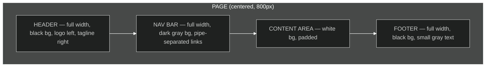
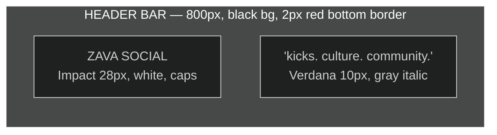
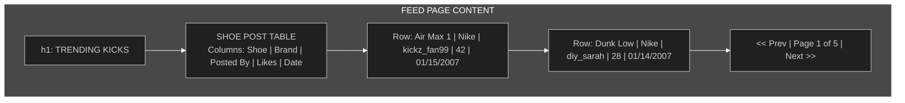
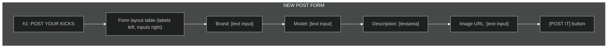
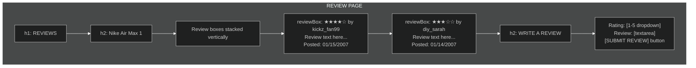
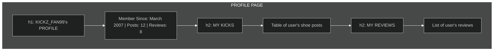
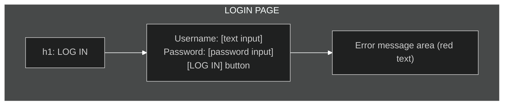

# Zava Social — Visual Design Specification

> Design document for the Zava Social frontend. This describes the visual language for a sneaker culture / DIY fashion community site, circa 2006–2007. Pre-Web 2.0. No gradients. No rounded corners. No Ajax shimmer. Just bold type, strong color, and table layouts that know what they are.

---

## Color Palette

The palette is inspired by early sneaker culture sites, streetwear brand pages, and DIY fashion forums of the mid-2000s. Bold, high-contrast, unapologetic. This is not pastel. This is not subtle.

| Role | Color | Hex | Usage |
|------|-------|-----|-------|
| **Black** | ██ | `#000000` | Page background, header background, primary text on light backgrounds |
| **White** | ██ | `#FFFFFF` | Text on dark backgrounds, content area background |
| **Zava Red** | ██ | `#CC0000` | Primary accent — logo, active nav links, important labels, buttons |
| **Concrete Gray** | ██ | `#333333` | Secondary text, borders, subtle backgrounds |
| **Smoke Gray** | ██ | `#999999` | Muted text, timestamps, metadata |
| **Off-White** | ██ | `#F0F0F0` | Alternating table rows, form backgrounds |
| **Link Blue** | ██ | `#0033CC` | Standard hyperlinks (default browser-era blue, but darker) |
| **Visited Purple** | ██ | `#660099` | Visited links |
| **Hover Red** | ██ | `#FF0000` | Link hover state |
| **Yellow Highlight** | ██ | `#FFCC00` | Star ratings, "NEW" badges, featured callouts |

### Color Philosophy

Black and white dominate. Red is the brand punch — used sparingly but always with impact. Yellow is the hype color, used for ratings and callouts. Link blue is intentionally close to browser default — users in 2006 expected blue underlined links and we don't fight that.

---

## Typography

Web fonts don't exist yet. We're working with the system font stack. Every choice here ships on every Windows XP and Mac OS X machine.

| Element | Font | Size | Weight | Notes |
|---------|------|------|--------|-------|
| **Logo / Site Title** | Impact, Arial Black, sans-serif | 28px | Normal (Impact is already bold) | ALL CAPS. White on black. |
| **Page Headings (h1)** | Arial Black, Arial, Helvetica, sans-serif | 22px | Bold | Uppercase optional per page |
| **Section Headings (h2)** | Arial, Helvetica, sans-serif | 16px | Bold | Used for "Latest Kicks", "Reviews", etc. |
| **Body Text** | Verdana, Geneva, sans-serif | 11px | Normal | Verdana was THE web font of this era — designed for screens |
| **Navigation Links** | Verdana, Geneva, sans-serif | 11px | Bold | Uppercase |
| **Metadata / Timestamps** | Verdana, Geneva, sans-serif | 10px | Normal | Gray (#999999) |
| **Form Labels** | Verdana, Geneva, sans-serif | 11px | Bold | — |
| **Button Text** | Verdana, Geneva, sans-serif | 11px | Bold | Uppercase |
| **Footer Text** | Verdana, Geneva, sans-serif | 10px | Normal | Gray on dark |

### Typography Philosophy

Verdana at 11px is the workhorse. It was designed by Matthew Carter specifically for screen readability at small sizes — every web designer in 2006 knew this. Impact for the logo gives that streetwear/poster feel. Arial Black for headings provides weight without being decorative. Nothing fancy. This is function.

---

## Layout Structure

**Fixed-width, table-based, centered.** 800px wide. No fluid layout. No CSS positioning for structure. Tables are the grid system.

### Master Layout



### Master Table Structure

The outermost structure is a single centered table at 800px. Every page shares this skeleton:

```
<table class="container" width="800" cellpadding="0" cellspacing="0" border="0" align="center">
  <tr><td> <!-- HEADER --> </td></tr>
  <tr><td> <!-- NAV --> </td></tr>
  <tr><td> <!-- CONTENT (varies per page) --> </td></tr>
  <tr><td> <!-- FOOTER --> </td></tr>
</table>
```

The `body` has a dark background (#000000). The container table sits on top of it. Content area is white. This gives the classic "content island on dark page" look that was everywhere in 2005–2007.

---

## Header Design



- **Background:** Black (#000000)
- **Bottom border:** 2px solid Zava Red (#CC0000) — the one splash of color
- **Left side:** "ZAVA SOCIAL" in Impact, white, all caps, 28px
- **Right side:** Tagline "kicks. culture. community." in Verdana 10px, italic, gray (#999999)
- **Padding:** 15px on all sides
- **Height:** ~60px natural height from content

The red bottom border is the signature design element. It separates the header from the nav with a bold line of color.

---

## Navigation Design

**Pipe-separated horizontal links in a dark gray bar.** Not a table-cell nav, not a list — just text links separated by pipe characters (`|`). This was the dominant nav pattern on forums, blogs, and community sites of the era.

- **Background:** Dark gray (#333333)
- **Text:** Verdana 11px, bold, uppercase, white
- **Active/current page:** Zava Red (#CC0000)
- **Separator:** ` | ` in gray (#999999)
- **Padding:** 8px 15px
- **Links:** HOME | POST A SHOE | REVIEWS | MY PROFILE | LOGOUT

On hover, links turn Zava Red. No underlines in the nav — color change only.

---

## Footer Design

- **Background:** Black (#000000)
- **Top border:** 1px solid #333333
- **Text:** Verdana 10px, gray (#999999), centered
- **Content:**
  - Line 1: `© 2007 Zava Social. All rights reserved.`
  - Line 2: `Contact Us | Terms of Use | Privacy Policy`
  - Line 3: A subtle "Best viewed in Internet Explorer 6.0 or Firefox 1.5" text at 9px
- **Padding:** 15px

---

## Page-by-Page Layout

### Feed Page (Home / Browse Trending Kicks)

The main page. Shows a reverse-chronological feed of shoe posts.



- **Page heading:** "TRENDING KICKS" — h1, Arial Black, uppercase
- **Feed display:** An HTML data table with visible borders and alternating row colors
- **Columns:** Shoe Name (linked), Brand, Posted By (linked to profile), Likes, Date Posted
- **Table styling:** 1px solid #CCCCCC borders, header row has black background with white text, alternating rows white/#F0F0F0
- **Shoe name links** are blue, bold — the primary action
- **Pagination:** Simple text links at bottom: `<< Prev | Page 1 of 5 | Next >>`
- **Sidebar consideration:** None. Single column. Full width content. Sidebars are a Web 2.0 thing.

### Shoe Post Page (Share Your Kicks)

The form for posting a new shoe to the community.



- **Page heading:** "POST YOUR KICKS" — h1
- **Form layout:** Two-column table — labels in left cells (right-aligned, bold), inputs in right cells
- **Input widths:** Text inputs are 350px wide. Textarea is 350px × 150px.
- **Submit button:** Red background (#CC0000), white text, bold, uppercase "POST IT", 1px solid dark border
- **Form container:** Slight inset — 1px solid #CCCCCC border around the form table, 10px padding
- **Required field markers:** Red asterisk (*) next to required fields — classic pattern

### View Post Page (Shoe Detail)

Shows a single shoe post with its details and associated reviews.

- **Shoe info section:** Image (if URL provided) on the left in a table cell, details on the right
- **Image:** Displayed at max 300px wide, 2px solid black border
- **Details:** Brand, Model, Posted By, Date, Likes — laid out in a definition-list style (bold label, value)
- **Description:** Full paragraph below the image/detail row
- **Reviews section:** Below, separated by a 1px gray hr. Uses the review table layout (see Review Page)
- **"Write a Review" link:** Prominent, red text, bold

### Review Page

Displays reviews for a shoe and the form to submit a new one.



- **Review boxes** (`.reviewBox`): Each review is in its own bordered container — 1px solid #CCCCCC, 10px padding, 10px bottom margin
- **Star rating display:** Yellow (#FFCC00) star characters (★) and empty stars (☆) — pure text, no images needed
- **Reviewer name:** Linked to profile, bold
- **Review text:** Normal Verdana 11px
- **Review date:** Small gray text, right-aligned
- **Review form:** Same two-column table layout as the shoe post form. Rating is a `<select>` dropdown (1–5). Textarea for review text.

### Profile Page

Simple user profile showing their posts and reviews.



- **Username** in the h1, uppercase
- **Member info line:** Simple text — "Member Since: March 2007 | Posts: 12 | Reviews: 8"
- **"My Kicks" section:** Same table format as the feed, but only this user's posts
- **"My Reviews" section:** Stacked review boxes, same as review page
- **No edit functionality** — profile is read-only (phase 2 never happened)

### Login Page

Minimal. Functional. No frills.



- **Centered form** — the form table is narrower (400px), centered within the content area
- **Heading:** "LOG IN" — h1
- **Two fields:** Username and Password, standard text/password inputs
- **Submit button:** Same red button style as other forms — "LOG IN"
- **Error display:** Red text (#CC0000) above the form when login fails — "Invalid username or password."
- **No "forgot password"** — this is 2007, you email the admin

---

## Form Styling

Forms in 2006 were styled minimally. CSS control over form elements was inconsistent across browsers, so designers kept it simple.

- **Text inputs:** 1px solid #999999 border, 4px padding, Verdana 11px, white background
- **Textareas:** Same border/padding as inputs
- **Select dropdowns:** Default browser styling — CSS couldn't reliably style these in 2006
- **Buttons:** Background #CC0000, color white, font-weight bold, 1px solid #990000 border, 6px 15px padding, Verdana 11px, uppercase text, cursor: hand (IE) / pointer
- **Labels:** Verdana 11px bold, right-aligned in form table cells
- **Focus states:** Not styled — browser default focus rings were expected and appropriate

---

## Image Treatment

- **Shoe images:** 2px solid #000000 border. No rounded corners (CSS can't do this). 5px margin around.
- **No thumbnails** — images are shown at whatever size the URL provides, constrained by `width="300"` in the HTML attribute
- **Alt text:** Required on all images for basic accessibility (even in 2006, some of us cared)
- **Broken image handling:** The browser's default broken image icon shows. That's life in 2006.

---

## Era-Appropriate Visual Touches

These details sell the authenticity. Use with taste:

| Element | Include? | Notes |
|---------|----------|-------|
| "Best viewed in IE6" footer text | ✅ Yes | Small, gray, in the footer. Authentic. |
| Hit counter | ❌ No | Too cheesy — Zava is a community site, not a GeoCities page |
| Animated GIFs | ❌ No | Sneaker culture sites were clean, not cluttered |
| "NEW!" badges | ✅ Yes | Yellow (#FFCC00) text next to recent posts (< 24 hours). Bold, small. |
| Pipe-separated links | ✅ Yes | Nav and footer links separated by ` | ` |
| `<marquee>` | ❌ No | We have standards |
| Table borders | ✅ Yes | Visible 1px borders on data tables. This is how you showed tabular data. |
| "Welcome back, username!" | ✅ Yes | In the nav bar area, right-aligned. Verdana 10px, gray. |
| Copyright with year | ✅ Yes | © 2007 in footer |
| Text-based star ratings | ✅ Yes | ★★★★☆ using Unicode stars. Yellow. |

---

## CSS Class Reference

These are the class names defined in `zava.css` that Shuri should use in the JSP pages:

| Class | Element | Purpose |
|-------|---------|---------|
| `.container` | `<table>` | Main 800px centered wrapper table |
| `.header` | `<td>` | Header cell — black bg, logo area |
| `.headerTitle` | `<span>` | Logo text styling |
| `.headerTagline` | `<span>` | Tagline text styling |
| `.nav` | `<td>` | Navigation bar cell |
| `.navLink` | `<a>` | Individual nav links |
| `.navActive` | `<a>` | Currently active nav link |
| `.navSeparator` | `<span>` | The pipe separator |
| `.navUser` | `<span>` | "Welcome back, username!" text |
| `.content` | `<td>` | Main content area cell |
| `.footer` | `<td>` | Footer cell |
| `.footerLink` | `<a>` | Footer links |
| `.dataTable` | `<table>` | Data display tables (feed, posts) |
| `.dataHeader` | `<tr>` | Table header row |
| `.dataRowAlt` | `<tr>` | Alternating row background |
| `.shoeCard` | `<div>` | Individual shoe post container (on detail page) |
| `.shoeImage` | `` | Shoe image styling |
| `.reviewBox` | `<div>` | Individual review container |
| `.reviewStars` | `<span>` | Star rating display |
| `.reviewMeta` | `<span>` | Review metadata (author, date) |
| `.formTable` | `<table>` | Form layout table |
| `.formLabel` | `<td>` | Form label cells |
| `.formInput` | `<td>` | Form input cells |
| `.formButton` | `<input>` | Submit buttons |
| `.required` | `<span>` | Red asterisk for required fields |
| `.errorMsg` | `<div>` | Error message display |
| `.successMsg` | `<div>` | Success message display |
| `.newBadge` | `<span>` | "NEW!" badge |
| `.pageTitle` | `<h1>` | Page title heading |
| `.sectionTitle` | `<h2>` | Section heading |
| `.loginForm` | `<table>` | Narrower centered login form table |
| `.metaText` | `<span>` | Small gray metadata text |
| `.pagination` | `<div>` | Pagination links container |

---

## Browser Compatibility Notes

- **Target:** Internet Explorer 6/7, Firefox 1.5/2.0
- **CSS Level:** CSS 2.1 only — no CSS3 properties
- **No transparency:** No `rgba()`, no `opacity` (IE6 doesn't support it reliably)
- **No PNG transparency:** Use GIF for any images with transparency (IE6 PNG bug)
- **Box model:** Be aware of IE6 box model differences — use `border-collapse: collapse` on tables
- **Fonts:** System fonts only — Arial, Verdana, Impact, Georgia, Trebuchet MS, Times New Roman

---

*Design by Parker (Graphic Designer) — Zava Social, 2007*
*"It's not retro if you were there."*
